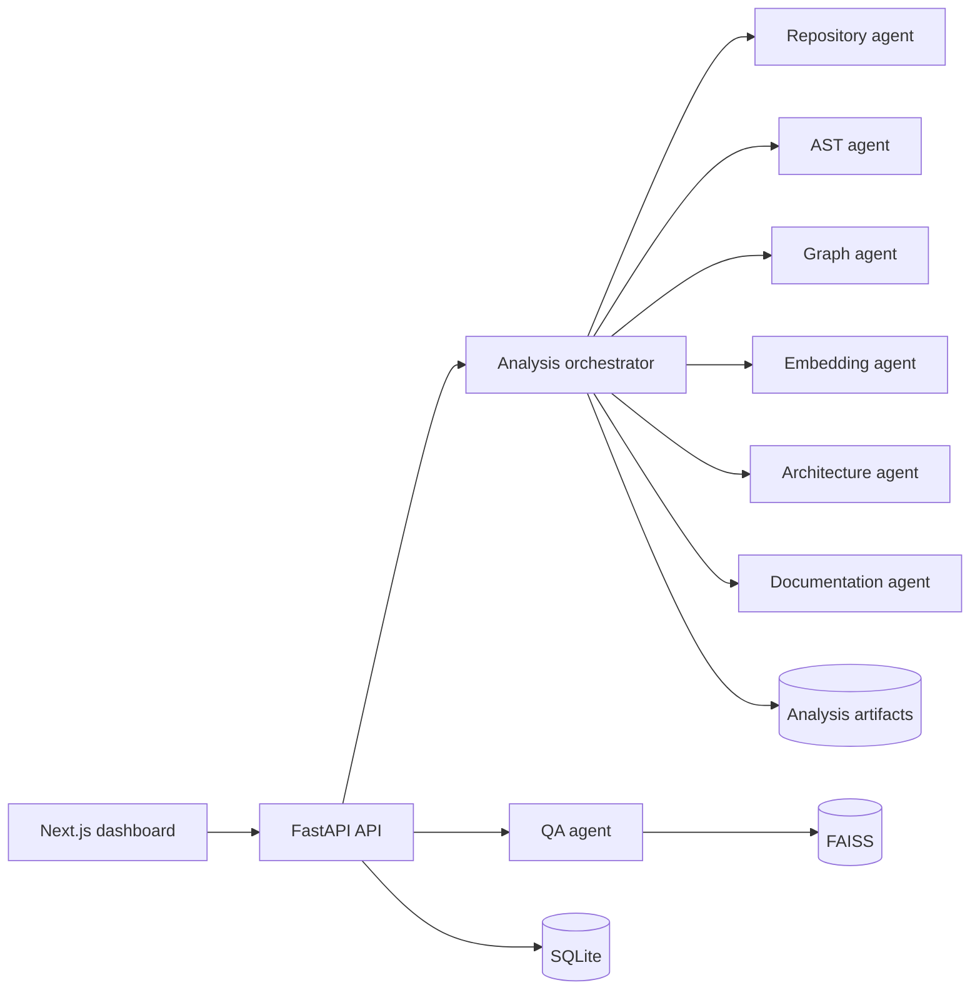

<div align="center">

<h1>🔬 CodeAutopsy</h1>

<p><strong>Understand an unfamiliar codebase in five minutes — not five days.</strong></p>
<p>Paste a public GitHub URL. Get dependency graphs, call maps, an inferred architecture, a written onboarding guide, a maintainability report, and a chat interface that answers questions with citations back to exact file/line ranges.</p>

<p>
  <a href="https://code-autopsy-nine.vercel.app"></a>
</p>

<p>
  
  
  
  
  
  
  
  
  
</p>

<p>
  
  
  
</p>

<p>
  <a href="https://code-autopsy-nine.vercel.app"><strong>Live Demo</strong></a> ·
  <a href="#-engineering-highlights"><strong>Engineering Highlights</strong></a> ·
  <a href="#-architecture"><strong>Architecture</strong></a> ·
  <a href="#-getting-started"><strong>Getting Started</strong></a> ·
  <a href="docs/API.md"><strong>API Docs</strong></a>
</p>

</div>

<br/>

<p align="center">
  
</p>

<p align="center">
  <sub><em>👆 Drop a hero screenshot or GIF at <code>docs/screenshots/overview.png</code> — see <a href="#-screenshots">Screenshots</a> below.</em></sub>
</p>

---

## 🩺 The problem

Every time you join a new codebase, you pay the same tax: clone it, wander the file tree, guess at the architecture, and interrupt a teammate to ask "wait, what actually calls what?" That ramp-up is slow, repetitive, and rarely documented anywhere reusable.

**CodeAutopsy automates the first day.** It performs a full "autopsy" on a Python repository — static analysis first, AI-authored narrative second — and hands you back the map a senior engineer would have drawn for you.

## ✨ What it does

| | |
|---|---|
| 🧬 **Deterministic repo analysis** | Clones the repo and parses every Python file with Tree-sitter — modules, classes, functions, imports, complexity. No LLM required for this layer. |
| 🕸️ **Dependency & call graphs** | Interactive React Flow graphs of module imports and approximate function call chains. |
| 🏛️ **Architecture inference** | Infers the likely pattern (layered monolith, MVC, microservice, …) with a confidence score and cited evidence. |
| ⚠️ **Risk & maintainability report** | Complexity heuristics surface hotspots and a ranked findings list with an overall maintainability score. |
| 📘 **Auto-generated onboarding guide** | A Markdown walkthrough written for a new contributor's first day, grounded in the actual repo. |
| 💬 **Source-grounded Q&A** | Ask questions in plain English; answers are retrieved via FAISS + sentence-transformer embeddings and cited to exact file/line ranges. |
| 📡 **Live progress via SSE** | Analysis runs as a background job and streams stage-by-stage progress to the UI in real time — no polling. |
| 🔌 **Bring-your-own LLM key** | Fully functional with zero AI cost — paste a Groq key in Settings to unlock the authored reports and chat. |

## 🎯 Engineering highlights

*A few decisions worth calling out if you're evaluating the code, not just the demo:*

- **Stateless agent pipeline.** Every analysis stage (repo, AST, graph, embedding, architecture, documentation, QA) is an independent agent following a strict `run(input, context) -> output` contract — no shared globals, no hidden state. Each is unit-testable and swappable in isolation (see `backend/tests/`).
- **Graceful degradation by design.** The entire deterministic pipeline — cloning, parsing, graphing, risk scoring — works with zero LLM configuration. The AI layer (architecture reasoning, onboarding prose, chat) is strictly additive and fails safe when no Groq key is present, rather than breaking the product.
- **Real-time job orchestration.** Analysis runs as an in-process background task and streams `stage.started` / `stage.progress` / `artifact.ready` / `run.completed` events over Server-Sent Events, so the frontend reflects true backend state instead of guessing with a spinner.
- **Immutable, versioned runs.** Every analysis run is content-addressed and immutable once complete (`analysis/{repository_id}/{run_id}`), with each artifact row tracking a schema version and checksum — safe to diff, cache, or compare across runs.
- **Security-conscious by default.** Only HTTPS GitHub URLs are clonable (no local paths, no arbitrary protocols), repo size/file-count/time are hard-capped, analyzed source is **never executed**, and untrusted repo content is explicitly labeled as data (not instructions) in every LLM prompt — a basic but often-skipped prompt-injection mitigation.
- **Retrieval done properly.** Source is chunked syntax-aware, embedded with `all-MiniLM-L6-v2` into a per-run FAISS index, and every chat answer carries back file path, line interval, and a relevance score — not just prose.

## 🖥️ Live demo

**[code-autopsy-nine.vercel.app →](https://code-autopsy-nine.vercel.app)**

Paste any public GitHub Python repository URL and watch it get dissected live — dependency graphs, call maps, risk report, and grounded chat, streamed stage by stage.

## 🏗️ Architecture



Full breakdown — agent contracts, persistence model, reliability/security constraints — lives in [`docs/ARCHITECTURE.md`](docs/ARCHITECTURE.md).

## 🧰 Tech stack

<table>
<tr>
<td valign="top" width="50%">

**Frontend**
- Next.js 15 (App Router) + React 19 + TypeScript
- Tailwind CSS
- React Flow (`@xyflow/react`) — dependency/call graphs
- Mermaid — diagram rendering

</td>
<td valign="top" width="50%">

**Backend**
- FastAPI + Uvicorn, async, Python 3.11
- SQLAlchemy 2.0 + SQLite (`aiosqlite`)
- Tree-sitter — Python AST parsing
- NetworkX — dependency/call graph construction
- Sentence-Transformers + FAISS — embeddings & retrieval
- Groq (`llama-3.3-70b-versatile`) — authored reports & chat

</td>
</tr>
</table>

**Deployment:** frontend on Vercel, backend on Render — see [`DEPLOYMENT.md`](DEPLOYMENT.md).

## 📂 Project structure

```text
CodeAutopsy/
├── app/                          # Next.js App Router entry (layout, page, globals)
├── components/
│   ├── dashboard.tsx             # Shell: navigation, case state, analysis lifecycle
│   ├── api-client.ts             # Typed fetch client for the FastAPI backend
│   └── views/                    # overview, graph-view, architecture, onboarding, risks, chat
├── backend/
│   ├── app/
│   │   ├── main.py               # FastAPI app & all HTTP/SSE routes
│   │   ├── config.py             # Env-driven settings (pydantic-settings)
│   │   ├── agents/               # repo, ast, graph, embedding, architecture, documentation, qa
│   │   ├── domain/                # ORM models & shared utils
│   │   ├── services/              # orchestrator (job runner) & risk service
│   │   └── infrastructure/        # db engine/session setup
│   ├── tests/                    # pytest suite for the agents
│   └── requirements.txt
├── docs/
│   ├── ARCHITECTURE.md
│   ├── API.md
│   ├── DATA_MODELS.md
│   └── ROADMAP.md
└── DEPLOYMENT.md                 # Vercel + Render free-tier deploy guide
```

## 🚀 Getting started

### Prerequisites

- Node.js 18+ and npm
- Python 3.11 (`.python-version`)
- A [Groq API key](https://console.groq.com/) *(optional — unlocks authored reports & chat; everything else works without it)*

### 1. Clone

```bash
git clone https://github.com/harish05-q/CodeAutopsy.git
cd CodeAutopsy
```

### 2. Backend (FastAPI)

```bash
cd backend
python -m venv venv
source venv/bin/activate        # Windows: venv\Scripts\activate
pip install -r requirements.txt

echo "GROQ_API_KEY=your_key_here" > .env   # optional

cd ..
python -m uvicorn backend.app.main:app --reload --port 8000
```

API docs: `http://localhost:8000/docs`

### 3. Frontend (Next.js)

```bash
npm install
npm run dev
```

Open **`http://localhost:3000`**. Point `NEXT_PUBLIC_API_BASE` at your backend if it's not on `localhost:8000`, or paste a Groq key straight into the in-app Settings panel.

### 4. Tests

```bash
cd backend && pytest
```

## ⚙️ Configuration

| Variable | Where | Default | Purpose |
|---|---|---|---|
| `DATABASE_URL` | backend `.env` | `sqlite+aiosqlite:///./codeautopsy.db` | SQLAlchemy async connection string |
| `ANALYSIS_DIR` | backend `.env` | `./analysis` | Where generated case artifacts are written |
| `GROQ_API_KEY` | backend `.env` or frontend Settings | *(empty)* | Enables architecture/onboarding generation and chat |
| `GROQ_MODEL` | backend `.env` | `llama-3.3-70b-versatile` | Model used for authored artifacts |
| `MAX_REPO_SIZE_MB` / `MAX_FILE_COUNT` | backend `.env` | `100` / `2000` | Guardrails on cloned repository size |
| `NEXT_PUBLIC_API_BASE` | frontend `.env.local` | `http://localhost:8000/api/v1` | Base URL the dashboard calls |

## 🔍 How a run works, end to end

1. **Submit** — `POST /api/v1/repositories/analyze` queues a background run.
2. **Clone & manifest** — safe, shallow, HTTPS-only clone; manifest of frameworks, dependencies, file/LOC counts.
3. **Parse** — Tree-sitter extracts modules, classes, functions, imports, and per-symbol complexity.
4. **Graph** — NetworkX builds dependency and approximate call graphs, exported as React Flow nodes/edges.
5. **Score risk** — maintainability score and complexity hotspots.
6. **Embed** *(optional)* — source chunks embedded into a per-run FAISS index.
7. **Author** *(optional)* — architecture report, onboarding guide, and grounded chat answers via Groq.
8. **Stream** — every stage reports live progress over `GET /api/v1/analysis/{run_id}/events` (SSE).

## 📖 Documentation

- [**Architecture**](docs/ARCHITECTURE.md) — runtime topology, agent contracts, persistence model, security constraints
- [**API specification**](docs/API.md) — every endpoint, request/response shapes, SSE event types
- [**Data models**](docs/DATA_MODELS.md) — schema for repositories, runs, symbols, graphs, findings
- [**Roadmap**](docs/ROADMAP.md) — phased build plan and current status
- [**Deployment guide**](DEPLOYMENT.md) — Vercel + Render, free tier

## 🗺️ Status

The interactive dashboard, graph views, and full API/data-model contracts are complete, and the FastAPI backend — clone → parse → graph → risk → embed → author → chat — is implemented end to end and live in production. See [`docs/ROADMAP.md`](docs/ROADMAP.md) for what's next.

## 🖼️ Screenshots

<table>
<tr>
<td width="50%" align="center">

<br/><sub><strong>Overview</strong> — repository stats, architecture summary, maintainability</sub>
</td>
<td width="50%" align="center">

<br/><sub><strong>Dependency graph</strong> — module import map</sub>
</td>
</tr>
<tr>
<td width="50%" align="center">

<br/><sub><strong>Call graph</strong> — approximate function call chains</sub>
</td>
<td width="50%" align="center">

<br/><sub><strong>Architecture</strong> — inferred pattern with confidence & evidence</sub>
</td>
</tr>
<tr>
<td width="50%" align="center">

<br/><sub><strong>Risk report</strong> — maintainability score & hotspots</sub>
</td>
<td width="50%" align="center">

<br/><sub><strong>Chat</strong> — source-grounded Q&A with citations</sub>
</td>
</tr>
</table>

**To fill these in:**

1. Run the app locally or use the [live demo](https://code-autopsy-nine.vercel.app), analyze a real repo, and capture each of the six views above.
2. Save them into `docs/screenshots/` using the exact filenames referenced (`overview.png`, `dependency-graph.png`, `call-graph.png`, `architecture.png`, `risks.png`, `chat.png`) — they'll render automatically, here and at the top of the README.
3. Highest-impact single addition: a short screen-recording GIF of a full run (paste URL → live progress → graphs populating) saved as `docs/screenshots/demo.gif` and dropped in place of the hero image at the top.

## 🤝 Contributing

1. Fork and create a feature branch.
2. Keep agents stateless and follow the `run(input, context) -> output` contract ([`docs/ARCHITECTURE.md`](docs/ARCHITECTURE.md)).
3. Add/update tests under `backend/tests/` for backend changes.
4. Run `npm run lint`, `npm run typecheck`, and `pytest` before opening a PR.

## 📄 License

Licensed under the [MIT License](LICENSE) — free to use, modify, and distribute with attribution.

---

<div align="center">
<sub>Built by <a href="https://github.com/harish05-q">@harish05-q</a> · <a href="https://code-autopsy-nine.vercel.app">Live demo</a></sub>
</div>
