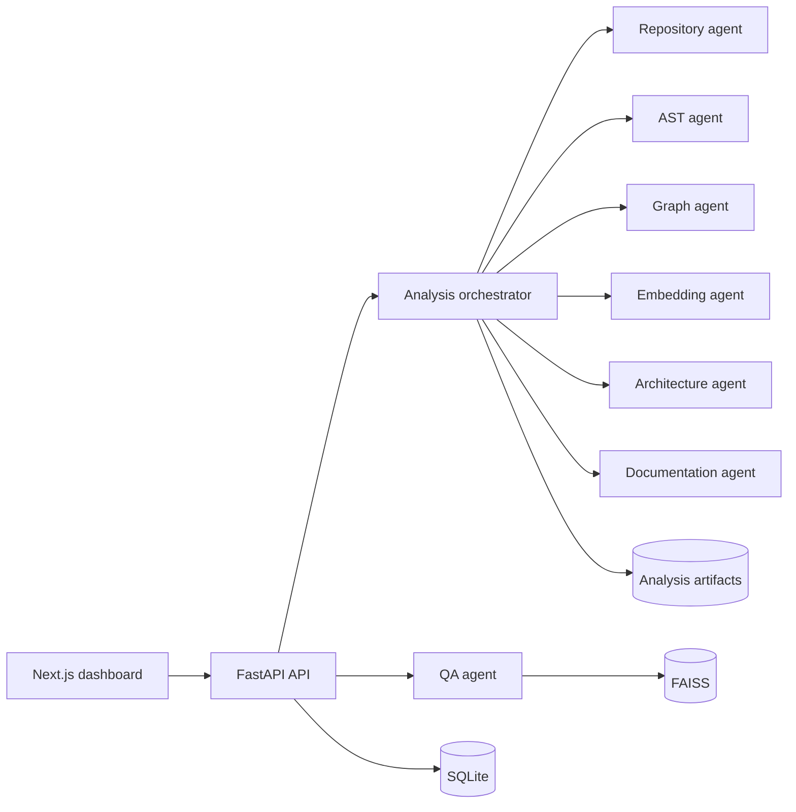

# CodeAutopsy architecture

## Product boundary

CodeAutopsy accepts a public GitHub URL and turns a Python repository into a versioned analysis case. A case contains deterministic artifacts (manifest, AST, graphs, risks and embeddings) and LLM-authored artifacts (summaries, architecture report and onboarding guide). Deterministic analysis remains usable when no LLM key is configured.

## Runtime topology



The MVP runs analysis in an in-process background task and exposes progress through server-sent events. The orchestrator interface permits replacement by a durable queue without changing API contracts.

## Intended folder structure

```text
codeautopsy/
├── app/                         # Next.js routes and global styles
├── components/                  # dashboard shell and product views
├── docs/                        # architecture, contracts, roadmap
├── backend/
│   ├── app/
│   │   ├── api/                 # HTTP routes and dependencies
│   │   ├── agents/              # independently testable analysis agents
│   │   ├── domain/              # case, graph, finding models
│   │   ├── services/            # orchestration and artifact services
│   │   ├── infrastructure/      # git, sqlite, faiss, groq adapters
│   │   └── main.py
│   └── tests/
└── analysis/{repository_id}/    # generated, immutable case artifacts
```

## Agent contracts

Every agent follows `run(input, context) -> output`, is stateless, writes no global state, and reports progress through the supplied context. The artifact service alone is responsible for persistence.

| Agent | Input | Output |
|---|---|---|
| Repository | repository URL, ref | checkout path, manifest |
| AST | checkout path, language | modules, symbols, imports |
| Graph | AST dataset | dependency and approximate call graphs |
| Embedding | symbols and source chunks | FAISS index metadata |
| Architecture | manifest and graphs | pattern, confidence, evidence |
| Documentation | all deterministic artifacts | Markdown documents |
| QA | question and repository ID | grounded answer with citations |

## Persistence model

SQLite stores operational metadata only: `repositories`, `analysis_runs`, `artifacts`, `findings`, and `chat_messages`. Large generated payloads live in `analysis/{repository_id}/{run_id}`. Each artifact row records its relative path, media type, schema version and checksum. A run is immutable after completion, making comparisons and cache reuse safe.

## Reliability and security

- Clone only HTTP(S) GitHub URLs; reject local paths and custom protocols.
- Enforce repository size, file count, process time and checkout depth limits.
- Never execute analyzed source code.
- Keep cloned repositories and generated artifacts outside web-served paths.
- Treat source content as untrusted input to LLM prompts and label it as data.
- Degrade cleanly when Groq is unavailable: preserve deterministic artifacts and mark authored reports pending.

## Frontend architecture

The current frontend is a responsive Next.js App Router application. `Dashboard` owns navigation and case-level state; each product surface is an isolated view. Graph views use React Flow. The visual language uses warm paper, ember, acid yellow, mint and peach to create an editorial “working laboratory” feel without relying on the standard black/purple/blue AI palette.
